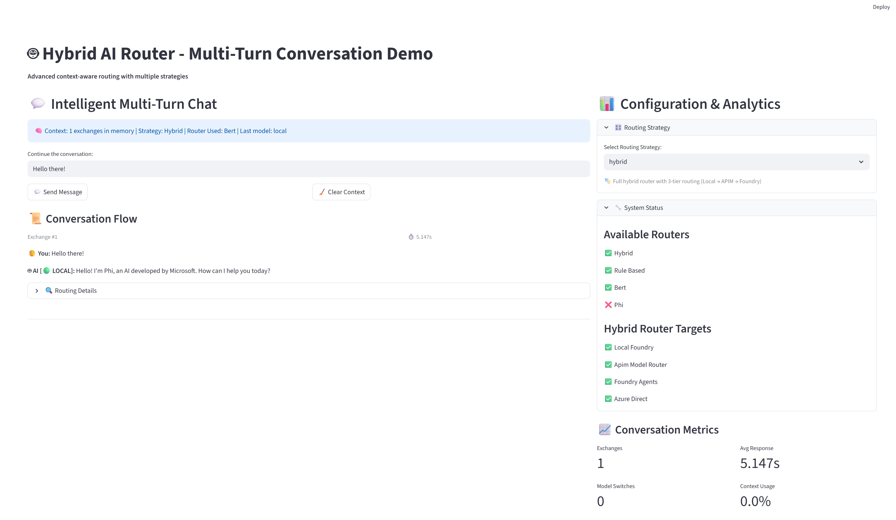
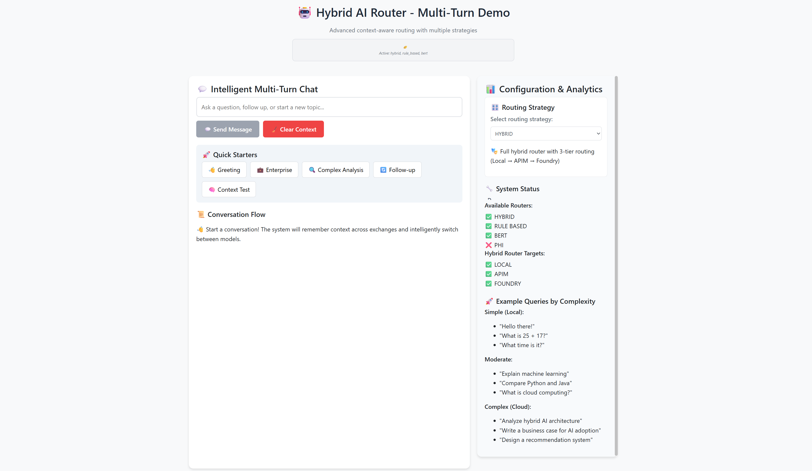
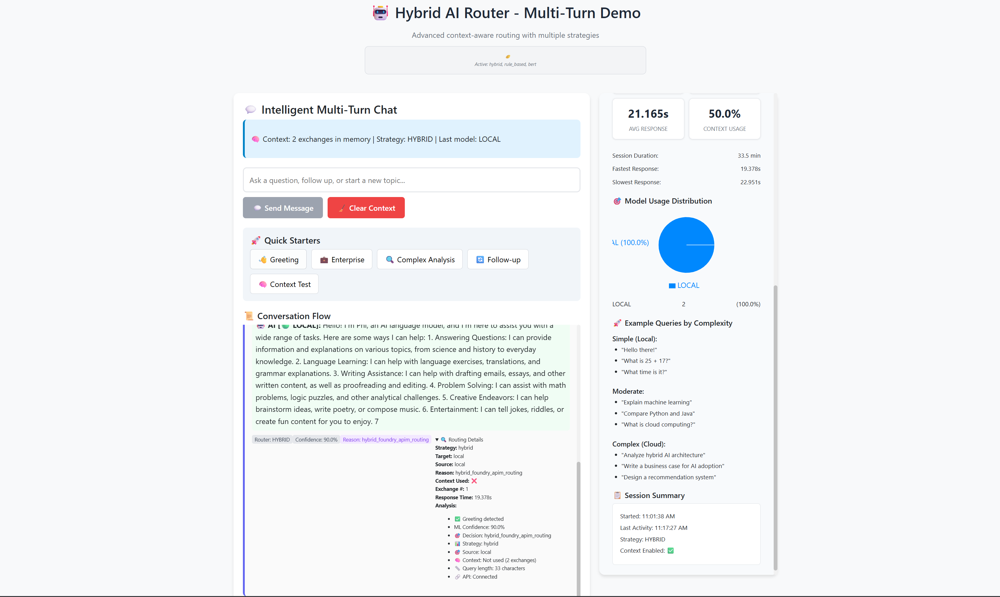
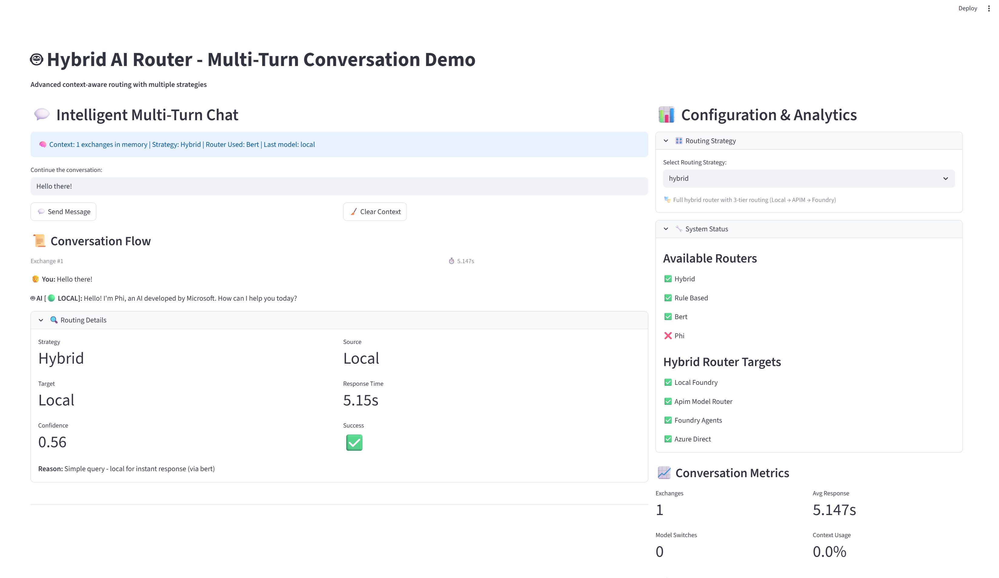
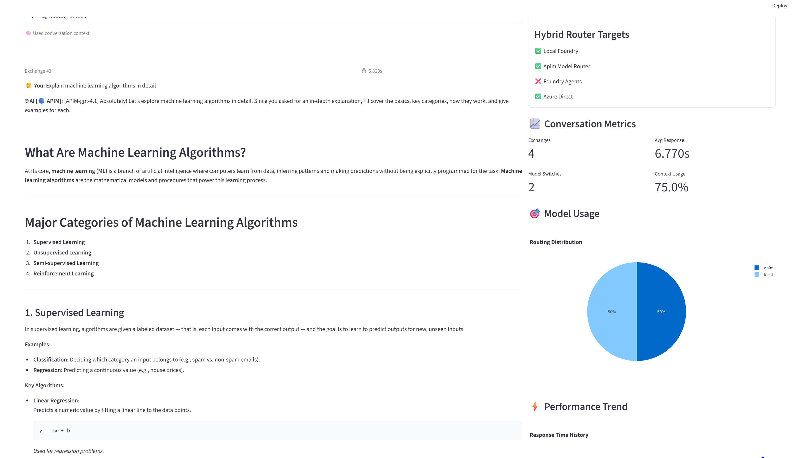

# Hybrid LLM Model Router Workshop

A hands-on workshop for building hybrid AI chatbots that intelligently route between on-device and cloud models

## 🎯 Overview

This workshop guides you through building a **hybrid AI chatbot** that combines the best of both worlds:

- **On-device models** (Azure Foundry Local) for fast, private responses
- **Cloud models** (Azure AI Foundry) for complex, sophisticated analysis
- **Intelligent routing** that automatically selects the best model for each query
- **Seamless context sharing** across model transitions

## 🖼️ Frontend Preview


*Interactive Streamlit chat interface with model routing transparency*

## 🏗️ Architecture

```
User Query → Router Logic → [Local Model] or [Cloud Model] → Unified Response
                ↓                ↓              ↓
            Analytics     Fast Response   Smart Analysis

Where:
• Local Model = Azure Foundry Local
• Cloud Model = Azure AI Foundry Agents | Azure OpenAI Direct | APIM
```

The system uses a **central Router Logic** that analyzes each query and intelligently routes to either the Local Model (Azure Foundry Local) for fast responses, or Cloud Model options (Azure AI Foundry Agents, Azure OpenAI Direct, or APIM) for smart analysis. Each path generates appropriate analytics while maintaining unified response handling and context continuity.

## 🚀 Key Features

- **⚡ Low-Latency Local Responses**: Simple queries answered instantly on-device
- **🧠 Intelligent Cloud Escalation**: Complex tasks automatically routed to Azure
- **🔄 Seamless Context Sharing**: Unified conversation across model switches
- **👁️ Full Transparency**: Clear indication of processing location
- **📊 Comprehensive Observability**: Telemetry and performance monitoring
- **🎨 Interactive Frontend**: Streamlit-based chat interface

## 📋 Prerequisites

- Python 3.10+
- Azure subscription with AI Foundry access
- Azure Foundry Local installation
- Azure OpenAI
- Azure API Management (optional)
- Application Insights
- Log Analytics Workspace (optional)
- Basic knowledge of Python and Azure services
- Deployed models: gpt-4-1, gpt-4o, gpt-4o-mini, model-router
- Roles: [Azure AI Foundry project roles](https://learn.microsoft.com/en-us/azure/ai-foundry/concepts/rbac-azure-ai-foundry#azure-ai-foundry-project-roles)

### Assumption

This workshop uses a Windows machine for on-device.

## 🛠️ Setup

1. **Clone the workshop materials**:

   ```bash
   git clone <repository-url>
   cd hybrid-router-workshop
   ```

2. **Create a virtual environment**:

   ```bash
   python -m venv .venv
   source .venv/bin/activate  # On Windows: .venv\Scripts\activate
   ```

3. **Install dependencies**:

   ```bash
   pip install -r requirements.txt
   ```

4. **Configure environment**:

   ```bash
   cp .env.example .env
   # Edit .env with your Azure credentials and endpoints
   ```

5. **Login into Azure**:

   ```bash
   az login
   ```

## � Quick Demo Scripts

**📁 All React demo scripts are located in the `react-hybrid-router` directory.**

### Available Demos

```bash
# Navigate to React directory first
cd react-hybrid-router

# Enhanced Demo (Recommended) - Dual backend support
./start_enhanced_demo.bat

# Basic Demo - Original backend 
./start_demo.bat

# React Demo with Python startup
./start_react_demo.bat
python start_react_demo.py

# Or use npm scripts
npm run demo-enhanced    # Enhanced demo
npm run demo            # Basic demo  
npm run demo-react      # React demo
npm run demo-python     # Python startup
```

**From project root, use the helper scripts:**
```bash
# Windows - Helper script that navigates to react-hybrid-router
.\start_demos.bat

# Linux/macOS - Helper script that navigates to react-hybrid-router
./start_demos.sh
```

> **⚠️ Important**: React demo scripts are **no longer** in the project root. All scripts have been moved to `react-hybrid-router` directory for better organization.





## �📚 Workshop Structure

### 🔧 Core Modules (`modules/`)

- **`router.py`**: Rule-based intelligent query routing logic
- **`bert_router.py`**: BERT-based query classification router
- **`phi_router.py`**: Phi SLM-based query routing with fine-tuning
- **`hybrid_router.py`**: Multi-tier hybrid routing orchestration
- **`azure_ai_manager.py`**: Azure AI Foundry integration and management
- **`context_manager.py`**: Conversation history and session management
- **`telemetry.py`**: Observability, performance tracking, and analytics
- **`config.py`**: Configuration management and environment settings
- **`helper.py`**: Utility functions and common operations

### 📓 Lab Notebooks (`notebooks/`)

#### **Lab 1: Environment Setup** (`lab1_environment_setup.ipynb`)

- Configure Azure Foundry Local and Cloud environments
- Test connectivity and model availability
- Verify authentication and basic functionality

#### **Lab 2: Local Model Testing** (`lab2_local_model_testing.ipynb`)

- Explore on-device model capabilities
- Test response times and quality
- Understand local model limitations and strengths

#### **Lab 3: Azure Model Testing** (`lab3_azure_model_testing.ipynb`)

- Configure Azure OpenAI integration
- Test cloud model capabilities
- Compare performance with local models

#### **Lab 3 (Alternative): Azure AI Foundry Agents** (`lab3_azure_ai_foundry_agents_testing.ipynb`)

- Work with Azure AI Foundry agent framework
- Implement agent-based conversation patterns
- Explore advanced agent capabilities and orchestration

#### **Lab 4: Model Routing Logic** (`lab4_model_routing.ipynb`)

- Implement intelligent query analysis
- Build routing decision engine
- Test routing accuracy with various query types

#### **Lab 4 (Extended): BERT Query Router** (`lab4_bert_query_router.ipynb`)

- Deep dive into BERT-based query classification
- Fine-tune models for specific routing scenarios
- Evaluate routing accuracy and performance

#### **Lab 4 (SLM): Phi Small Language Model Routing** (`lab4_phi_slm_routing.ipynb`)

- Implement routing using Phi small language models
- Fine-tune Phi models for routing decisions
- Compare SLM vs traditional ML approaches

#### **Lab 4 (Alternative): Foundry Agent Routing** (`lab4_foundry_agent_routing.ipynb`)

- Route between different Azure Foundry agents
- Implement multi-agent coordination
- Build agent-specific routing logic

#### **Lab 4 (Integration): API Management Router** (`lab4_apim_model_router.ipynb`)

- Integrate with Azure API Management
- Implement enterprise-grade routing patterns
- Add rate limiting and authentication

#### **Lab 5: Hybrid Orchestration** (`lab5_hybrid_orchestration.ipynb`)

- Combine local and cloud models seamlessly
- Implement conversation context sharing
- Build multi-turn conversation management

#### **Lab 6: Observability & Telemetry** (`lab6_observability_telemetry.ipynb`)

- Add comprehensive logging and monitoring
- Implement performance metrics collection
- Create analytics dashboard for insights

#### **Lab 6 Alternative: Telemetry with HybridFoundryAPIMRouter** (`lab6_alt_telemetry.ipynb`)

- Implement comprehensive telemetry collection
- Track performance across three routing tiers
- Monitor ML-powered routing decisions

#### **Lab 7: Frontend Chat Interface** (`lab7_frontend_chat_interface.ipynb`)

- Build Streamlit-based chat UI
- Implement real-time conversation interface
- Add visual indicators for model routing

#### **Lab 7 (Advanced): Frontend Chat Interface** (`lab7_advanced_routing_agents.ipynb`)

- Implementing sophisticated multi-agent routing systems
- Building complex decision trees for agent selection
- Creating advanced conversation orchestration patterns

## 🎯 Success Criteria

By completing this workshop, you will have built a system that demonstrates:

✅ **Low-Latency Local Responses**: Simple queries answered in <0.5s on-device  
✅ **Seamless Cloud Escalation**: Complex tasks automatically routed without user friction  
✅ **Context Continuity**: Unified conversation memory across model switches  
✅ **Transparency & Control**: Clear indication of processing location  
✅ **Performance Optimization**: Measurable speed and efficiency gains  
✅ **Stakeholder-Ready Demo**: Interactive interface for business validation  

### 📱 User Interface Examples


*Fast local model response with performance indicators*


*Complex cloud model response with routing explanation*

## 🏗️ Architecture Highlights

**Architecture highlights (Router Logic Design)**:

- **Router Logic**: Central decision engine with BERT, Phi SLM, and Hybrid routing
- **Local Model**: Azure Foundry Local for fast responses with local analytics
- **Cloud Model Options**:
  - Azure AI Foundry Agents (agent-based processing)
  - Azure OpenAI Direct (direct API access)
  - Azure APIM (API Management with backend routing)
- **Supporting Services**: Cosmos DB, Blob Storage, Key Vault, Log Analytics
- **Unified Response**: Single response path regardless of processing location
- **Context Continuity**: Maintained across all processing paths

## 📊 Expected Outcomes

### Performance Metrics

- **Local queries**: 70-80% of simple queries, <0.5s response time
- **Cloud queries**: 20-30% of complex queries, 1-3s response time
- **Context preservation**: 100% accuracy across model transitions
- **User satisfaction**: Seamless experience with transparency

### Technical Achievements

- **Hybrid Architecture**: Production-ready routing system
- **Scalable Design**: Modular components for easy enhancement
- **Comprehensive Monitoring**: Full observability stack
- **Business Value**: Clear ROI demonstration through metrics

## 🛟 Troubleshooting

### Common Issues

**Connection Problems**:

- Verify Azure credentials in `.env`
- Check Azure Foundry Local service status
- Confirm network connectivity

**Model Loading Issues**:

- Ensure sufficient local resources
- Verify model deployment in Azure
- Check API quotas and limits

**Routing Problems**:

- Review query classification logic
- Adjust complexity thresholds
- Test with various query types

## 🔗 Additional Resources

- [Azure AI Foundry Documentation](https://docs.microsoft.com/azure/ai-foundry)
- [Azure Foundry Local Setup Guide](https://github.com/guygregory/FoundryLocal)
- [OpenAI API Reference](https://platform.openai.com/docs/api-reference)
- [Streamlit Documentation](https://docs.streamlit.io)
- [MobileBERT Reference](https://huggingface.co/docs/transformers/model_doc/mobilebert#mobilebert)
- [Phi CookBook Reference](https://github.com/microsoft/PhiCookBook)

## 🤝 Contributing

This workshop is designed for educational purposes. Feedback and improvements are welcome:

1. Fork the repository
2. Create a feature branch
3. Submit a pull request with detailed description

## 📄 License

This workshop is provided under the MIT License. See `LICENSE` file for details.

## 🆘 Support

For workshop-specific questions:

- Create an issue in this repository
- Contact the workshop facilitators
- Join the discussion in our community forum

---

## Ready to build the future of hybrid AI? Let's get started with Lab 1! 🚀
